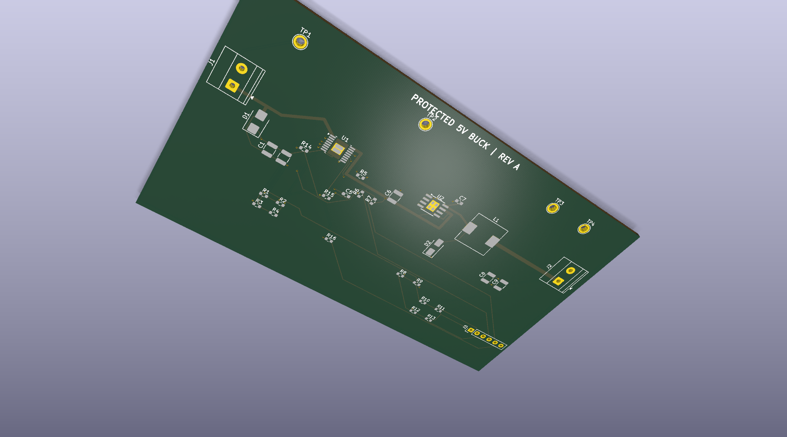
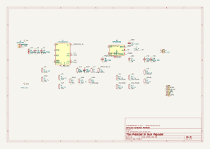
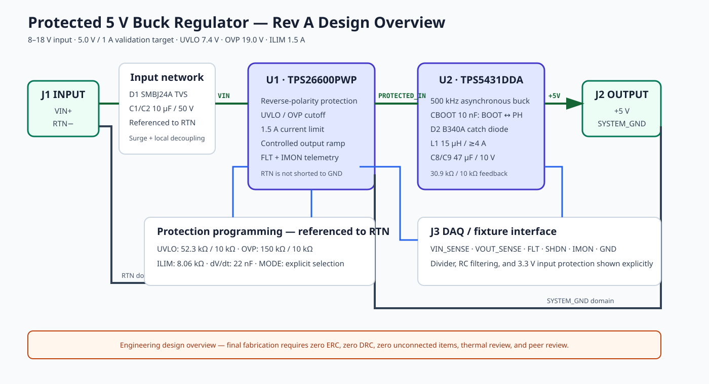
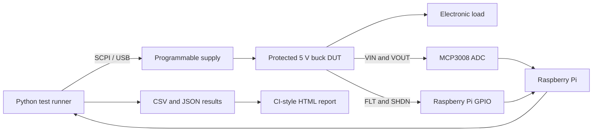

# Automated Hardware Validation Framework


A portfolio project combining a protected 5 V buck-converter PCB with a Python automated validation bench. It demonstrates PCB design, instrument automation, fault injection, safety interlocks, data logging, and CI-style reporting—the day-to-day concerns of hardware validation and systems-integration engineering.

> **Engineering status:** the software framework is operational. The KiCad 10 schematic passes ERC with zero violations, and the routed PCB passes DRC with zero violations and zero unconnected pads. This is still an engineering prototype, not a fabrication release: land patterns, thermal-via design, compensation, derating, enclosure constraints, and schematic/PCB parity need independent review.

## PCB preview



## KiCad schematic



The editable source is `hardware/protected_buck.kicad_sch`; its generated PDF is included for design review. KiCad 10.0.6 reports zero ERC errors and zero ERC warnings, and the automated parity check matches all 88 schematic pins to 88 PCB pads.

## Electrical architecture



This review overview explicitly separates the TPS26600 `RTN` domain from `SYSTEM_GND`, shows the required 10 nF BOOT-to-PH capacitor, and identifies the protected DAQ signals.

The DUT uses a TPS26600 eFuse front end and a TPS5431 asynchronous buck stage. It targets 8–18 V input, regulated 5 V output, and a 1 A continuous validation load. The fixture connector exposes divided VIN/VOUT measurements, active-low fault status, shutdown control, and current-monitor signals.

## System architecture



All test logic depends on an abstract `Bench` interface. The same suite runs against a deterministic behavioral simulator in CI or against physical SCPI instruments and Raspberry Pi I/O in the lab.

## Automated test coverage

| Test | Stimulus | Measurement | Pass criterion |
|---|---|---|---|
| Line regulation | VIN from 8 V to 18 V | VOUT | 5.0 V ±3% |
| Load regulation | Load from 0 A to 1 A | VOUT | 5.0 V ±3% |
| Output ripple | 2,000 samples at 10 MS/s | Robust Vpp | <50 mVpp |
| UVLO rising | VIN from 6 V to 9 V | Turn-on threshold | 7.1–7.9 V |
| OVP rising | VIN from 17 V to 21 V | Fault threshold | 18.4–19.6 V |
| Overcurrent trip | Load from 0.5 A to 1.8 A | Fault threshold | 1.35–1.65 A |

The MCP3008 measures DC rails and low-frequency behavior. The physical ripple test deliberately requests a 10 MS/s window through a SCPI oscilloscope adapter because a low-speed ADC cannot characterize the TPS5431's 500 kHz switching ripple. Use a bandwidth-limited scope measurement with a short ground spring and verify the scope's actual acquisition settings.

## Example validation result

```text
PASS   Line regulation: VOUT range 4.995–5.011 V
PASS   Load regulation: VOUT range 4.992–5.010 V
PASS   Output ripple: Ripple 30.3 mVpp; mean 4.993 V
PASS   UVLO rising: Turn-on detected at 7.50 V
PASS   OVP rising: Trip detected at 19.05 V
PASS   Overcurrent trip: Trip detected at 1.500 A
```

View the self-contained [HTML report with measurement plots](artifacts/report.html), [machine-readable results](artifacts/results.json), and individual CSV files in `artifacts/`.

Fault injection verifies that real specification failures are detected:

```powershell
python -m validation.cli run --backend sim --fault high-ripple --output artifacts-failing
```

This produces a failing 91.3 mVpp result and a nonzero process exit code suitable for CI gating.

## Repository layout

```text
hardware/
  protected_buck.kicad_pro      KiCad project
  protected_buck.kicad_sch      complete editable schematic; ERC clean
  protected_buck.kicad_pcb      routed two-layer PCB; DRC clean
  protected_buck.dsn/.ses       reproducible Specctra routing exchange
  protected_buck_3d.png         generated 3D preview
  protected_buck_layout.pdf     copper-layer review PDF
  protected_buck_schematic.pdf  schematic review PDF
  BOM.csv                       preliminary bill of materials
  DESIGN.md                     calculations and layout rationale
  BRINGUP.md                    controlled first-power procedure
validation/
  instruments.py                bench abstraction
  simulator.py                  deterministic behavioral DUT model
  real_bench.py                 PyVISA supply/load/scope, MCP3008, and GPIO adapters
  test_cases.py                 validation procedures and limits
  report.py                     CSV, JSON, and HTML reporting
tests/                          software unit tests
scripts/generate_board.py       reproducible KiCad PCB generator
scripts/finalize_route.py       imports routing session and finalizes reviewed nets
scripts/generate_schematic_modern.py  reproducible KiCad 10 schematic generator
scripts/check_design_parity.py  checks every schematic pin against its PCB pad net
.github/workflows/              simulated validation workflow
```

## Quick start

Simulation requires Python 3.10+ and no third-party runtime packages:

```powershell
python -m validation.cli run --backend sim --output artifacts
python -m unittest discover -s tests -v
```

Open `artifacts/report.html` after the run.

## Physical bench setup

```powershell
pip install -e ".[raspberry-pi]"
Copy-Item validation/real_bench.example.json bench.json
python -m validation.cli run --backend real --config bench.json --output artifacts-real
```

Before using the real backend:

1. Verify SCPI resource names and commands against the exact instruments.
2. Calibrate every ADC divider and verify the oscilloscope probe ratio, bandwidth limit, and channel.
3. Install an independent physical emergency-off.
4. Configure the supply limit to 2 A or less and OVP to 22 V.
5. Complete [BRINGUP.md](hardware/BRINGUP.md) with the first run attended.

The real-bench factory rejects configurations above the 2 A project safety ceiling before opening hardware resources. `safe_shutdown()` removes the electronic load and source output if a test raises an exception.

## Hardware design targets

| Characteristic | Target |
|---|---:|
| Operating input range | 8–18 V |
| Output voltage | 5.0 V ±3% |
| Validation load | 1.0 A continuous |
| Automated ripple screen | <50 mVpp |
| UVLO rising threshold | 7.5 V ±0.4 V |
| OVP rising threshold | 19.0 V ±0.6 V |
| Current-limit trip | 1.50 A ±0.15 A |

See [DESIGN.md](hardware/DESIGN.md) for calculations, [VALIDATION_STATUS.md](hardware/VALIDATION_STATUS.md) for the exact engineering status, and [ROUTING_CHECKLIST.md](hardware/ROUTING_CHECKLIST.md) for the post-routing review gates.

## Before fabrication

- Verify exposed-pad thermal-via patterns with the PCB manufacturer.
- Recheck compensation, bootstrap, current-limit mode, component derating, and fault behavior against the ordered part numbers.
- Add and mechanically validate mounting holes and enclosure clearances.
- Run schematic/PCB parity checks, inspect the autorouted geometry manually, and complete an independent engineering review.
- Assemble one prototype and complete the controlled bring-up and physical validation plan.

This repository is an engineering portfolio artifact and learning platform. It is not a certified power product or production manufacturing release.
